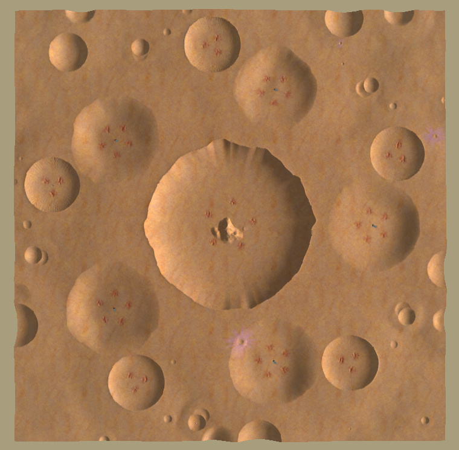

# LoonyBin
## Procedural crater map for Spring RTS

### Two Allyteams (180-degree rotational symmetry)

### Three Allyteams (120-degree rotational symmetry)

### Four Allyteams (double reflectional symmetry)

### Five Allyteams (72-degree rotational symmetry)

### No Symmetry
